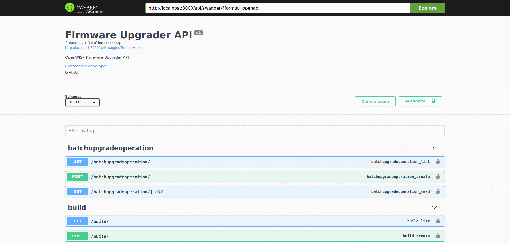
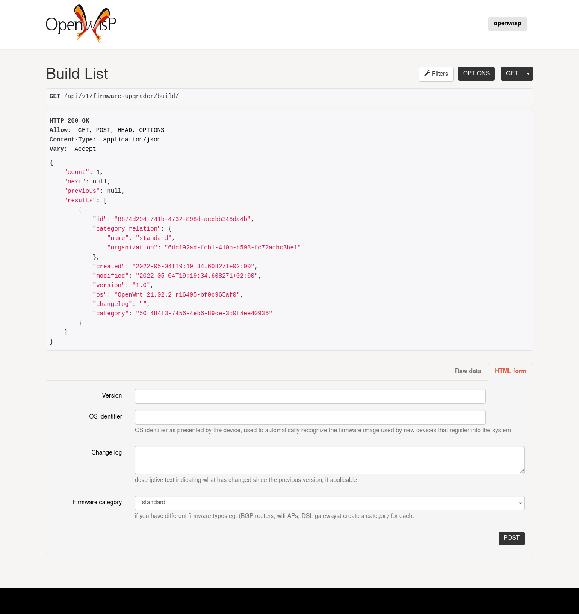

openwisp-firmware-upgrader
==========================

.. image:: https://travis-ci.org/openwisp/openwisp-firmware-upgrader.svg
   :target: https://travis-ci.org/openwisp/openwisp-firmware-upgrader

.. image:: https://coveralls.io/repos/openwisp/openwisp-firmware-upgrader/badge.svg
  :target: https://coveralls.io/r/openwisp/openwisp-firmware-upgrader

.. image:: https://requires.io/github/openwisp/openwisp-firmware-upgrader/requirements.svg?branch=master
   :target: https://requires.io/github/openwisp/openwisp-firmware-upgrader/requirements/?branch=master
   :alt: Requirements Status

------------

OpenWISP firmware upgrade module (work in progress).

------------

.. contents:: **Table of Contents**:
   :backlinks: none
   :depth: 3

------------

Install Depdendencies
---------------------

Install spatialite and sqlite:

.. code-block:: shell

    sudo apt-get install sqlite3 libsqlite3-dev openssl libssl-dev
    sudo apt-get install gdal-bin libproj-dev libgeos-dev libspatialite-dev

Setup (integrate in an existing django project)
-----------------------------------------------

Follow the setup instructions of `openwisp-controller
<https://github.com/openwisp/openwisp-controller>`_, then add the settings described below.

.. code-block:: python

    INSTALLED_APPS = [
        # django apps
        # openwisp2 admin theme (must be loaded here)
        'openwisp_utils.admin_theme',
        # all-auth
        'django.contrib.sites',
        'allauth',
        'allauth.account',
        'django_extensions',
        'private_storage',
        # openwisp2 modules
        'openwisp_users',
        'openwisp_controller.pki',
        'openwisp_controller.config',
        'openwisp_controller.connection',
        'openwisp_controller.geo',
        'openwisp_firmware_upgrader',
        # admin
        'django.contrib.admin',
        'django.forms',
        # other dependencies
        'sortedm2m',
        'reversion',
        'leaflet',
        # rest framework
        'rest_framework',
        'rest_framework.authtoken',
        'rest_framework_gis',
        'django_filters',
        'drf_yasg',
        # channels
        'channels',
    ]

``urls.py``:

.. code-block:: python

    from django.conf import settings
    from django.contrib import admin
    from django.conf.urls import include, url
    from django.contrib.staticfiles.urls import staticfiles_urlpatterns

    urlpatterns = [
        url(r'^admin/', include(admin.site.urls)),
        url(r'', include('openwisp_controller.urls')),
        url(r'^firmware/', include('openwisp_firmware_upgrader.private_storage.urls')),
        url(r'^api/v1/', include('openwisp_users.api.urls')),
        url(r'^api/v1/', include('openwisp_firmware_upgrader.api.urls')),
    ]

    urlpatterns += staticfiles_urlpatterns()

Add ``apptemplates.Loader`` to template loaders:

.. code-block:: python

    TEMPLATES = [
        {
            'BACKEND': 'django.template.backends.django.DjangoTemplates',
            'DIRS': [os.path.join(os.path.dirname(BASE_DIR), 'templates')],
            'OPTIONS': {
                'loaders': [
                    'apptemplates.Loader',
                    'django.template.loaders.filesystem.Loader',
                    'django.template.loaders.app_directories.Loader',
                    'openwisp_utils.loaders.DependencyLoader',
                ],
                'context_processors': [
                    'django.template.context_processors.debug',
                    'django.template.context_processors.request',
                    'django.contrib.auth.context_processors.auth',
                    'django.contrib.messages.context_processors.messages',
                ],
            },
        }
    ]

Configure caching (you may use a different cache storage if you want):

.. code-block:: python

    CACHES = {
        'default': {
            'BACKEND': 'django_redis.cache.RedisCache',
            'LOCATION': 'redis://localhost/0',
            'OPTIONS': {
                'CLIENT_CLASS': 'django_redis.client.DefaultClient',
            }
        }
    }

    SESSION_ENGINE = 'django.contrib.sessions.backends.cache'
    SESSION_CACHE_ALIAS = 'default'

Configure celery (you may use a different broker if you want):

.. code-block:: python

    # here we show how to configure celery with redis but you can
    # use other brokers if you want, consult the celery docs
    CELERY_BROKER_URL = 'redis://localhost/1'

    INSTALLED_APPS.append('djcelery_email')
    EMAIL_BACKEND = 'djcelery_email.backends.CeleryEmailBackend'

If you decide to use redis (as shown in these examples),
install the requierd python packages::

    pip install redis django-redis

Settings
--------

``OPENWISP_FIRMWARE_UPGRADER_RETRY_OPTIONS``
~~~~~~~~~~~~~~~~~~~~~~~~~~~~~~~~~~~~~~~~~~~~

+--------------+--------------+
| **type**:    | ``dict``     |
+--------------+--------------+
| **default**: | see below    |
+--------------+--------------+

.. code-block:: python

    # default value of OPENWISP_FIRMWARE_UPGRADER_RETRY_OPTIONS:

    dict(
       max_retries=4,
       retry_backoff=60,
       retry_backoff_max=600,
       retry_jitter=True,
    )

Retry settings for recoverable failures during firmware upgrades.

By default if an upgrade operation fails before the firmware is flashed
(eg: because of a network issue during the upload of the image),
the upgrade operation will be retried 4 more times with an exponential
random backoff and a maximum delay of 10 minutes.

For more information regarding these settings, consult the `celery documentation
regarding automatic retries for known errors
<https://docs.celeryproject.org/en/stable/userguide/tasks.html#automatic-retry-for-known-exceptions>`_.

``OPENWISP_FIRMWARE_UPGRADER_TASK_TIMEOUT``
~~~~~~~~~~~~~~~~~~~~~~~~~~~~~~~~~~~~~~~~~~~

+--------------+--------------+
| **type**:    | ``int``      |
+--------------+--------------+
| **default**: | ``600``      |
+--------------+--------------+

Timeout for the background tasks which perform firmware upgrades.

If for some unexpected reason an upgrade remains stuck for more than 10 minutes,
the upgrade operation will be flagged as failed and the task will be killed.

This should not happen, but a global task time out is a best practice when
using background tasks because it prevents the situation in which an unexpected
bug causes a specific task to hang, which will quickly fill all the available
slots in a background queue and prevent other tasks from being executed, which
will end up affecting negatively the rest of the application.

``OPENWISP_CUSTOM_OPENWRT_IMAGES``
~~~~~~~~~~~~~~~~~~~~~~~~~~~~~~~~~~

+--------------+-------------+
| **type**:    | ``tuple``   |
+--------------+-------------+
| **default**: | ``None``    |
+--------------+-------------+

This setting can be used to add new image types for OpenWRT, eg:

.. code-block:: python

    OPENWISP_CUSTOM_OPENWRT_IMAGES = (
        ('customimage-squashfs-sysupgrade.bin', {
            'label': 'Custom WAP-1200',
            'boards': ('CWAP1200',)
        }),
    )

**Notes**:

- ``label`` it's the human readable name of the model which will be
  displayed in the UI
- ``boards`` is a tuple of board names with which the different versions
  of the hardware are identified on OpenWRT; this field is used to
  recognize automatically devices which have registered into OpenWISP

``OPENWISP_FIRMWARE_UPGRADER_MAX_FILE_SIZE``
~~~~~~~~~~~~~~~~~~~~~~~~~~~~~~~~~~~~~~~~~~~~

+--------------+------------------------------+
| **type**:    | ``int``                      |
+--------------+------------------------------+
| **default**: | ``30 * 1024 * 1024`` (30 MB) |
+--------------+------------------------------+

This setting can be used to set the maximum size limit for firmware images, eg:

.. code-block:: python

    OPENWISP_FIRMWARE_UPGRADER_MAX_FILE_SIZE = 40 * 1024 * 1024  # 40MB

**Notes**:

- Value must be specified in bytes. ``None`` means unlimited.

``OPENWISP_FIRMWARE_UPGRADER_API``
~~~~~~~~~~~~~~~~~~~~~~~~~~~~~~~~~~

+--------------+-----------+
| **type**:    | ``bool``  |
+--------------+-----------+
| **default**: | ``False`` |
+--------------+-----------+

Indicates whether the API for Firmware Upgrader is enabled or not.

REST API
--------

To enable the API the setting
`OPENWISP_FIRMWARE_UPGRADER_API <#openwisp-firmware-upgrader-api>`_
must be set to ``True``.

Live documentation
~~~~~~~~~~~~~~~~~~

A general live API documentation (following the OpenAPI specification) at ``/api/v1/docs/``.

Browsable web interface
~~~~~~~~~~~~~~~~~~~~~~~

Additionally, opening any of the endpoints `listed below <#list-of-endpoints>`_
directly in the browser will show the `browsable API interface of Django-REST-Framework
<https://www.django-rest-framework.org/topics/browsable-api/>`_,
which makes it even easier to find out the details of each endpoint.

Authentication
~~~~~~~~~~~~~~

See openwisp-users: `authenticating with the user token
<https://github.com/openwisp/openwisp-users#authenticating-with-the-user-token>`_.

When browsing the API via the `Live documentation <#live-documentation>`_
or the `Browsable web page <#browsable-web-interface>`_, you can also use
the session authentication by logging in the django admin.

List of endpoints
~~~~~~~~~~~~~~~~~

Since the detailed explanation is contained in the `Live documentation <#live-documentation>`_
and in the `Browsable web page <#browsable-web-interface>`_ of each point,
here we'll provide just a list of the available endpoints,
for further information please open the URL of the endpoint in your browser.

List mass upgrade operations
############################

.. code-block:: text

    GET ​/v1​/firmware​/batch-upgrade-operation​/

Get mass upgrade operation detail
#################################

.. code-block:: text

    GET ​/v1​/firmware​/batch-upgrade-operation​/{id}​/

List firmware builds
####################

.. code-block:: text

    GET ​/v1​/firmware​/build​/

Create firmware build
#####################

.. code-block:: text

    POST ​/v1​/firmware​/build​/

Get firmware build details
##########################

.. code-block:: text

    GET ​/v1​/firmware​/build​/{id}​/

Change details of firmware build
################################

.. code-block:: text

    PUT ​/v1​/firmware​/build​/{id}​/

Patch details of firmware build
###############################

.. code-block:: text

    PATCH ​/v1​/firmware​/build​/{id}​/

Delete firmware build
#####################

.. code-block:: text

    DELETE ​/v1​/firmware​/build​/{id}​/

Get list of images of a firmware build
######################################

.. code-block:: text

    GET ​/v1​/firmware​/build​/{id}​/image​/

Upload new firmware image to the build
######################################

.. code-block:: text

    POST ​/v1​/firmware​/build​/{id}​/image​/

Get firmware image details
##########################

.. code-block:: text

    GET ​/v1​/firmware​/build​/{build_pk}​/image​/{id}​/

Delete firmware image
#####################

.. code-block:: text

    DELETE ​/v1​/firmware​/build​/{build_pk}​/image​/{id}​/

Download firmware image
#######################

.. code-block:: text

    GET ​/v1​/firmware​/build​/{build_pk}​/image​/{id}​/download​/

List firmware categories
########################

.. code-block:: text

    GET ​/v1​/firmware​/category​/

Create new firmware category
############################

.. code-block:: text

    POST ​/v1​/firmware​/category​/

Get firmware category details
#############################

.. code-block:: text

    GET ​/v1​/firmware​/category​/{id}​/

Change the details of a firmware category
#########################################

.. code-block:: text

    PUT ​/v1​/firmware​/category​/{id}​/

Patch the details of a firmware category
########################################

.. code-block:: text

    PATCH ​/v1​/firmware​/category​/{id}​/

Delete a firmware category
##########################

.. code-block:: text

    DELETE ​/v1​/firmware​/category​/{id}​/

Installing for development
--------------------------

Install your forked repo:

.. code-block:: shell

    git clone git://github.com/<your_fork>/openwisp-firmware-upgrader
    cd openwisp-firmware-upgrader/
    python setup.py develop

Install test requirements:

.. code-block:: shell

    pip install -r requirements-test.txt

Create database:

.. code-block:: shell

    cd tests/
    ./manage.py migrate
    ./manage.py createsuperuser

Launch development server:

.. code-block:: shell

    ./manage.py runserver 0.0.0.0:8000

You can access the admin interface at http://127.0.0.1:8000/admin/.

Run celery and celery-beat with the following commands
(separate terminal windows are needed):

.. code-block:: shell

    # (cd tests)
    celery -A openwisp2 worker -l info
    celery -A openwisp2 beat -l info

Run tests with:

.. code-block:: shell

    # run qa checks
    ./run-qa-checks

    # standard tests
    ./runtests.py

    # tests for the sample app
    SAMPLE_APP=1 ./runtests.py --keepdb --failfast

When running the last line of the previous example, the environment variable
``SAMPLE_APP`` activates the app in ``/tests/openwisp2/sample_firmware_upgrader/``
which is a simple django app that extends ``openwisp-firmware-upgrader`` with
the sole purpose of testing its extensibility, for more information regarding
this concept, read the following section.

Extending openwisp-firmware-upgrader
------------------------------------

The ``tests/openwisp2/sample-firmware-upgrader`` may serve as an example for
extending *openwisp-firmware-upgrader* in your own application.

*openwisp-firmware-upgrader* provides a set of models and admin classes which can
be imported, extended and reused by third party apps.

To extend *openwisp-firmware-upgrader*, **you MUST NOT** add it to ``settings.INSTALLED_APPS``,
but you must create your own app (which goes into ``settings.INSTALLED_APPS``), import the
base classes from openwisp-firmware-upgrader and add your customizations.

In order to help django find the static files and templates of *openwisp-firmware-upgrader*,
you need to perform the steps described below.

**Premise**: if you plan on using a customized version of this module,
we suggest to start with it since the beginning, because migrating your data
from the default module to your extended version may be time consuming.

1. Install ``openwisp-firmware-upgrader``
~~~~~~~~~~~~~~~~~~~~~~~~~~~~~~~~~~~~~~~~~

Install (and add to the requirement of your project) openwisp-firmware-upgrader::

    pip install openwisp-firmware-upgrader

2. Add ``EXTENDED_APPS``
~~~~~~~~~~~~~~~~~~~~~~~~

Add the following to your ``settings.py``:

.. code-block:: python

    EXTENDED_APPS = ('openwisp_firmware_upgrader',)

3. Add ``openwisp_utils.staticfiles.DependencyFinder``
~~~~~~~~~~~~~~~~~~~~~~~~~~~~~~~~~~~~~~~~~~~~~~~~~~~~~~

Add ``openwisp_utils.staticfiles.DependencyFinder`` to
``STATICFILES_FINDERS`` in your ``settings.py``:

.. code-block:: python

    STATICFILES_FINDERS = [
        'django.contrib.staticfiles.finders.FileSystemFinder',
        'django.contrib.staticfiles.finders.AppDirectoriesFinder',
        'openwisp_utils.staticfiles.DependencyFinder',
    ]

4. Add ``openwisp_utils.loaders.DependencyLoader``
~~~~~~~~~~~~~~~~~~~~~~~~~~~~~~~~~~~~~~~~~~~~~~~~~~

Add ``openwisp_utils.loaders.DependencyLoader`` to ``TEMPLATES`` in your ``settings.py``:

.. code-block:: python

    TEMPLATES = [
        {
            'BACKEND': 'django.template.backends.django.DjangoTemplates',
            'OPTIONS': {
                'loaders': [
                    'django.template.loaders.filesystem.Loader',
                    'django.template.loaders.app_directories.Loader',
                    'openwisp_utils.loaders.DependencyLoader',
                ],
                'context_processors': [
                    'django.template.context_processors.debug',
                    'django.template.context_processors.request',
                    'django.contrib.auth.context_processors.auth',
                    'django.contrib.messages.context_processors.messages',
                ],
            },
        }
    ]

5. Add swapper configurations
~~~~~~~~~~~~~~~~~~~~~~~~~~~~~

Add the following to your ``settings.py``:

.. code-block:: python

    # Setting models for swapper module
    FIRMWARE_UPGRADER_CATEGORY_MODEL = 'YOUR_MODULE_NAME.Category'
    FIRMWARE_UPGRADER_BUILD_MODEL = 'YOUR_MODULE_NAME.Build'
    FIRMWARE_UPGRADER_FIRMWAREIMAGE_MODEL = 'YOUR_MODULE_NAME.FirmwareImage'
    FIRMWARE_UPGRADER_DEVICEFIRMWARE_MODEL = 'YOUR_MODULE_NAME.DeviceFirmware'
    FIRMWARE_UPGRADER_BATCHUPGRADEOPERATION_MODEL = 'YOUR_MODULE_NAME.BatchUpgradeOperation'
    FIRMWARE_UPGRADER_UPGRADEOPERATION_MODEL = 'YOUR_MODULE_NAME.UpgradeOperation'

Extending models
~~~~~~~~~~~~~~~~

For the purpose of showing an example, we added a simple "details" field to the
`models of the sample app in the test project <https://github.com/openwisp/openwisp-firmware-upgrader/tree/master/tests/openwisp2/sample_firmware_upgrader/models.py>`_.

You can add fields in a similar way in your ``models.py`` file.

Extending the admin
~~~~~~~~~~~~~~~~~~~

Please checkout the `admin.py file of the sample app <https://github.com/openwisp/openwisp-firmware-upgrader/tree/master/tests/openwisp2/sample_firmware_upgrader/admin.py>`_.

You can change ``CategoryAdmin``, ``BuildAdmin`` and
``BatchUpgradeOperationAdmin`` and these changes will be reflected in
your admin interface.

Extending the views
~~~~~~~~~~~~~~~~~~~

If you need to customize the behavior of the API views or the private storage view,
the classes you need to extend are:

- ``openwisp_firmware_upgrader.api.views``
- ``openwisp_firmware_upgrader.private_storage.views``

You will also need to create custom URL routers and import them into your root urlconf, eg:

.. code-block:: python

    urlpatterns = [
        # ... other urls ...
        url(r'^firmware/', include('<your_custom_app>.private_storage.urls')),
        url(r'^api/v1/', include('<your_custom_app>.api.urls')),
    ]

Reusing the base tests
~~~~~~~~~~~~~~~~~~~~~~

When developing a custom application based on this module, it's a good
idea to import and run the `base tests <https://github.com/openwisp/openwisp-firmware-upgrader/tree/master/openwisp_firmware_upgrader/tests/base>`_
too, so that you can be sure the changes you're introducing are not breaking
some of the existing features of openwisp-firmware-upgrader.

In case you need to add breaking changes, you can overwrite the tests defined
in the base classes to test your own behavior.

Contributing
------------

Please read the `OpenWISP contributing guidelines
<http://openwisp.io/docs/developer/contributing.html>`_.
