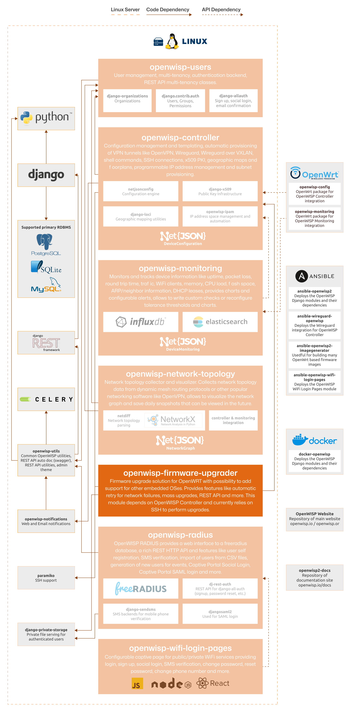

Firmware Upgrader
=================

.. seealso::

    **Source code**: `github.com/openwisp/openwisp-firmware-upgrader
    <https://github.com/openwisp/openwisp-firmware-upgrader>`_.

A firmware upgrade solution designed specifically for OpenWrt devices,
with the potential to support other embedded operating systems in the
future. It offers a robust and automated upgrade process, featuring
functionalities such as automatic device detection, retry mechanisms for
network failures, mass upgrades, and a REST API for integration.

For a comprehensive overview of features, please refer to the
:doc:`user/intro` page.

The following diagram illustrates the role of the Firmware Upgrader module
within the OpenWISP architecture.

    **OpenWISP Architecture: highlighted firmware upgrader module**

.. important::

    For an enhanced viewing experience, open the image above in a new
    browser tab.

    Refer to :doc:`/general/architecture` for more information.

.. toctree::
    :caption: Firmware Upgrader Usage Docs
    :maxdepth: 1

    ./user/intro.rst
    ./user/quickstart.rst
    ./user/automatic-device-firmware-detection.rst
    ./user/custom-firmware-upgrader.rst
    ./user/rest-api.rst
    ./user/settings.rst

.. toctree::
    :caption: Firmware Upgrader Developer Docs
    :maxdepth: 2

    Developer Docs Index <developer/index.rst>
